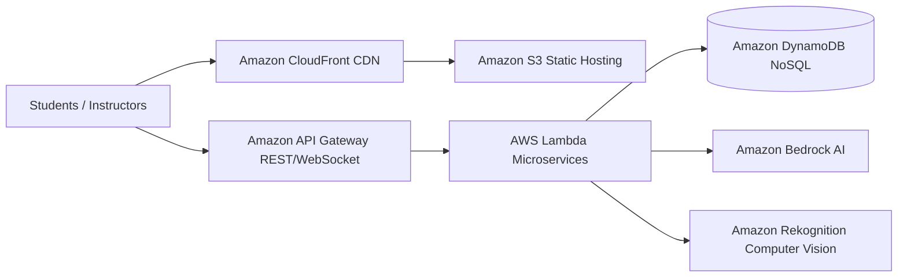

# Building an AI-Powered Online Examination Platform on AWS Cloud (Serverless Architecture)

> *This article was published and discussed on the **AWS Study Group Vietnam** community:*  
> 👉 [**View Original Facebook Post & Discussion**](https://www.facebook.com/share/p/1D6dVxB4R3/?)  
> 🌐 *Live Product Demo:* [**Aura Academic Frontend S3 Hosting**](http://aura-academic-fe-2024.s3-website-ap-southeast-1.amazonaws.com/vi/)

---

## 1. Introduction: Digital Transformation in EdTech Needs a Cloud-Native Boost

In modern educational environments, conducting scalable online exams is critical for universities and training centers. However, traditional Learning Management Systems (LMS) consistently face 3 major bottlenecks:
1. **Poor Scalability:** When thousands of students log in simultaneously at exam start time, traditional VPS or physical servers easily experience network traffic bottlenecks or crash completely.
2. **High Infrastructure Maintenance Costs:** To prepare for peak exam weeks that occur only a few times a year, institutions must pay heavily to maintain oversized server clusters 24/7.
3. **Weak Supervision & Proctoring:** Difficulties preventing academic dishonesty, such as proxy exam taking, unauthorized tab switching, or external cheat sheets.

To solve these pain points, our engineering team designed **Aura Academic | Smart Exam Engine** — a next-generation intelligent examination and automated proctoring platform built purely on **Serverless Architecture** across the **Amazon Web Services (AWS)** ecosystem.

---

## 2. Aura Academic Serverless Solution Architecture

Instead of managing complex virtual machines (EC2 instances), we embraced the **"Zero Server Management"** philosophy to maximize scalability while keeping operational costs at a minimum:

### Core AWS Services Applied:
* **Amazon S3 + Amazon CloudFront (Frontend Layer):** The entire user interface (built using Next.js/React with smooth micro-animations and Dark/Light themes) is compiled as static files hosted on **Amazon S3**. When users connect, **Amazon CloudFront** acts as the global Edge CDN delivering content with sub-20ms latency while shielding our backend against Distributed Denial of Service (DDoS) attacks via **AWS Shield**.
* **AWS Lambda + Amazon API Gateway (Backend API Layer):** Business logic (user authentication, secure room creation, answer submission, automated grading) is decomposed into isolated microservices running on **AWS Lambda**. Functions spin up strictly when requests hit **API Gateway**, meaning zero idle server cost during non-exam hours.
* **Amazon DynamoDB (Database Layer):** To handle high-velocity write throughput from thousands of concurrent answer submissions and real-time audit logs, we utilized **DynamoDB** (NoSQL) with *On-Demand Capacity Mode*, delivering sub-millisecond response times and instant elasticity.

---

## 3. Cost Optimization & Pay-As-You-Go Economics

One of our most valuable takeaways from the **First Cloud Journey (FCJ)** program is FinOps architecture. By combining Serverless design with **AWS Free Tier / Credits**, the operating expenses for supporting thousands of students became astonishingly low:

| Infrastructure Layer | AWS Service Used | Pricing Mechanism | Estimated Monthly Cost |
| :--- | :--- | :--- | :--- |
| **Frontend & CDN** | Amazon S3 + CloudFront | Pay per storage & data transfer out | ~1.50 USD |
| **Backend API** | AWS Lambda + API Gateway | Pay per request (1M free tier requests/mo) | ~0.50 USD |
| **Database** | Amazon DynamoDB | Pay per read/write request units | ~1.00 USD |
| **AI/ML Services** | Bedrock + Rekognition | Pay per token generated / video frame processed | ~5.00 - 15.00 USD |
| **TOTAL** | **Cloud-Native Architecture** | **High Availability & Auto-Scaling** | **~8.00 - 18.00 USD/month** |

---

## 4. Conclusion & Advice for Cloud Beginners

Transitioning from monolithic mindset to **Cloud-Native & Serverless** engineering requires adapting to event-driven patterns and fine-grained IAM least-privilege security. However, once mastered, your development velocity (Time-to-Market) accelerates dramatically.

Start small, review the AWS Well-Architected Framework pillars regularly, and actively contribute your lessons learned back to the community!

---

> 💬 **What do you think about using Serverless for high-concurrency online exams?**  
> Leave your comments and suggestions on our Facebook community post:  
> 👉 [**Join the Discussion on AWS Study Vietnam**](https://www.facebook.com/share/p/1D6dVxB4R3/?)
