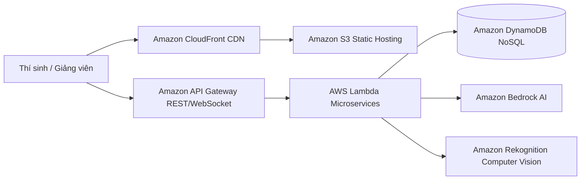

# Hành trình xây dựng Nền tảng Thi trực tuyến & Giám sát AI trên AWS Cloud (Serverless Architecture)

> *Bài viết được chia sẻ và thảo luận trên cộng đồng **AWS Study Group Vietnam**:*  
> 👉 [**Xem bài đăng gốc & bình luận trên Facebook**](https://www.facebook.com/share/p/1D6dVxB4R3/?)  
> 🌐 *Sản phẩm thực tế đang Live:* [**Aura Academic Frontend S3 Hosting**](http://aura-academic-fe-2024.s3-website-ap-southeast-1.amazonaws.com/vi/)

---

## 1. Mở đầu: Khi chuyển đổi số giáo dục cần một cú hích từ Cloud-Native

Trong bối cảnh giáo dục hiện đại, việc tổ chức các kỳ thi trực tuyến (Online Exams) đã trở thành một nhu cầu tất yếu cho các trường đại học, phổ thông và trung tâm đào tạo. Tuy nhiên, các hệ thống Learning Management System (LMS) truyền thống thường xuyên gặp phải 3 rào cản chí mạng:
1. **Khả năng chịu tải kém:** Khi hàng nghìn thí sinh cùng truy cập vào thời điểm bắt đầu thi, máy chủ vật lý hoặc VPS truyền thống dễ bị nghẽn mạng (bottleneck), sập server dẫn đến mất bài làm.
2. **Chi phí duy trì máy chủ cao:** Để sẵn sàng cho những đợt thi cao điểm diễn ra vài lần trong năm, nhà trường phải chi trả lượng chi phí rất lớn để thuê và duy trì các cụm máy chủ 24/7.
3. **Giám sát lỏng lẻo:** Khó kiểm soát hành vi gian lận (thi hộ, tra cứu tài liệu trái phép, chuyển đổi tab ứng dụng).

Từ những trăn trở đó, nhóm chúng tôi đã quyết định xây dựng **Aura Academic | Smart Exam Engine** — nền tảng thi trắc nghiệm và giám sát thông minh thế hệ mới, ứng dụng triệt để kiến trúc **Serverless** trên hệ sinh thái **Amazon Web Services (AWS)**.

---

## 2. Kiến trúc giải pháp Serverless của Aura Academic

Thay vì quản lý máy chủ ảo EC2 phức tạp, chúng tôi áp dụng triết lý **"Zero Server Management"** (Không cần quản trị máy chủ) của AWS để đạt độ khả mở tối đa và chi phí tối thiểu:

### Các dịch vụ AWS cốt lõi được ứng dụng:
* **Amazon S3 + Amazon CloudFront (Frontend Layer):** Toàn bộ giao diện người dùng (xây dựng bằng Next.js/React với hiệu ứng mượt mà, hỗ trợ Dark/Light mode) được compile thành static site và lưu trữ trên **Amazon S3**. Khi người dùng truy cập, **Amazon CloudFront** đóng vai trò là mạng biên (Edge CDN) phân phối nội dung toàn cầu với độ trễ dưới 20ms, đồng thời bảo vệ hệ thống khỏi các cuộc tấn công từ chối dịch vụ (DDoS) nhờ tích hợp **AWS Shield**.
* **AWS Lambda + Amazon API Gateway (Backend API Layer):** Logic nghiệp vụ (xác thực người dùng, tạo phòng thi, nộp bài, tính điểm) được chia nhỏ thành các hàm microservices chạy trên **AWS Lambda**. Chỉ khi có request từ **API Gateway** dội vào, Lambda mới khởi chạy và xử lý. Bạn không phải trả một đồng chi phí nào khi hệ thống ở trạng thái nhàn rỗi (Idle).
* **Amazon DynamoDB (Database Layer):** Với yêu cầu ghi nhận hàng nghìn câu trả lời và Audit Logs cùng lúc theo thời gian thực (Real-time), **DynamoDB** (NoSQL) với cơ chế *On-Demand Capacity Mode* là lựa chọn hoàn hảo, mang lại tốc độ truy xuất dưới mili giây (sub-millisecond latency) và tự động mở rộng theo lưu lượng thực tế.

---

## 3. Bài toán tối ưu chi phí (Cost Optimization & Pay-As-You-Go)

Một trong những bài học đắt giá nhất từ chương trình thực tập **First Cloud Journey (FCJ)** là tư duy tối ưu chi phí (FinOps). Với mô hình Serverless và tận dụng **AWS Free Tier / Credits**, chi phí vận hành cho một hệ thống quy mô hàng nghìn thí sinh được tối ưu đến mức khó tin:

| Thành phần hạ tầng | Dịch vụ AWS sử dụng | Cơ chế tính phí | Chi phí ước tính / Tháng |
| :--- | :--- | :--- | :--- |
| **Giao diện & CDN** | Amazon S3 + CloudFront | Trả theo dung lượng lưu trữ & băng thông | ~1.50 USD |
| **Backend API** | AWS Lambda + API Gateway | Trả theo số lượng Request (Miễn phí 1 triệu request đầu) | ~0.50 USD |
| **Cơ sở dữ liệu** | Amazon DynamoDB | Trả theo thao tác đọc/ghi (Read/Write Units) | ~1.00 USD |
| **Dịch vụ AI/ML** | Bedrock + Rekognition | Trả theo số Token xử lý và số phút video/ảnh phân tích | ~5.00 - 15.00 USD |
| **TỔNG CỘNG** | **Kiến trúc Cloud-Native** | **Hoạt động ổn định, chịu tải cao** | **~8.00 - 18.00 USD/tháng** |

---

## 4. Tổng kết & Lời khuyên cho các bạn mới bắt đầu học AWS

Việc chuyển dịch từ tư duy lập trình truyền thống sang tư duy **Cloud-Native & Serverless** ban đầu có thể gặp một ít bỡ ngỡ về cách phân tách sự kiện (Event-driven) và quản trị quyền truy cập (IAM Policies). Tuy nhiên, một khi bạn đã làm chủ được các công cụ như Lambda, API Gateway và DynamoDB, tốc độ phát triển sản phẩm (Time-to-Market) sẽ tăng lên gấp nhiều lần.

Hãy bắt đầu từ việc xây dựng những ứng dụng nhỏ, đọc kỹ tài liệu AWS Well-Architected Framework, và đừng ngần ngại chia sẻ những vướng mắc lên cộng đồng để cùng nhau tiến bộ!

---

> 💬 **Bạn nghĩ sao về giải pháp Serverless này cho các kỳ thi trực tuyến?**  
> Hãy để lại ý kiến thảo luận và góp ý cho nhóm tại bài đăng Facebook:  
> 👉 [**Tham gia bình luận trên AWS Study Vietnam tại đây**](https://www.facebook.com/share/p/1D6dVxB4R3/?)
