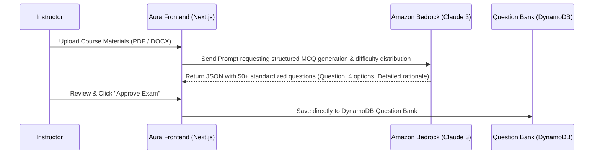

# Integrating Artificial Intelligence (Generative AI & Computer Vision) for Exam Supervision

> *This article was published and discussed on the **AWS Study Group Vietnam** community:*  
> 👉 [**View Original Facebook Post & Discussion**](https://www.facebook.com/photo/?fbid=1676460976896951&set=gm.2201043733993920&idorvanity=660548818043427)  
> 🌐 *Live Product Demo:* [**Aura Academic AI Proctoring**](http://aura-academic-fe-2024.s3-website-ap-southeast-1.amazonaws.com/vi/)

---

## 1. The Power of AI in Modern EdTech

While our Serverless foundation (S3, Lambda, DynamoDB) enables **Aura Academic** to scale seamlessly and minimize infrastructure costs, **Artificial Intelligence (AI/ML)** serves as the core differentiator driving complete automation and academic integrity across our platform.

In our second engineering blog post, our team shares detailed insights into integrating two premier AWS AI services: **Amazon Bedrock (Generative AI)** for intelligent exam generation, and **Amazon Rekognition (Computer Vision)** for automated secure room proctoring.

---

## 2. Lightning-Fast Exam Builder Powered by Amazon Bedrock

One of the most time-consuming workflows for educators is drafting and categorizing question banks from comprehensive, multi-hundred-page course materials. By integrating **Amazon Bedrock**, we tapped directly into cutting-edge Large Language Models (LLMs) like **Claude 3 (Anthropic)** and **Titan Embeddings** to automate exam creation:

### Key Technical Highlights:
* **Accurate Contextual Extraction:** The LLM deeply comprehends specialized academic terminology and categorizes questions according to Bloom's Taxonomy: *Remembering - Understanding - Applying - Analyzing*.
* **Zero Data Training Leakage:** Unlike commercial public AI APIs, documents uploaded through **Amazon Bedrock** are encrypted in transit and at rest within our private Virtual Private Cloud (VPC) and are never used to train base foundation models.

---

## 3. Intelligent AI Proctoring System with Amazon Rekognition

Enforcing absolute academic honesty across online examinations is virtually impossible using manual human supervision over video calls when classrooms exceed hundreds of students. **Amazon Rekognition** enabled us to build an automated real-time proctoring pipeline with >99% accuracy:

| Proctoring Capability | Amazon Rekognition Mechanism | Automated System Action |
| :--- | :--- | :--- |
| **Face Verification** | Compares student webcam capture at exam check-in against verified profile records (`CompareFaces API`). | Blocks exam entrance if facial similarity score falls below 90%, eliminating proxy exam attempts instantly. |
| **Multi-Face Detection** | Periodically samples webcam frames (`DetectFaces API`) to verify the number of distinct human faces present. | Triggers real-time alert and records incident log if more than one face is detected within the frame. |
| **Absence Detection** | Identifies when the webcam view becomes empty or if the candidate leaves their workstation continuously. | Displays on-screen warning and logs behavioral violation to the instructor audit dashboard. |

---

## 4. Edge-to-Cloud Processing Optimization

Continuously streaming HD video feeds from hundreds of webcams directly to the cloud would incur prohibitive network bandwidth and heavy API usage costs. To resolve this, we implemented a **Hybrid Edge-Cloud Processing** architecture:
1. **At the Browser (Client Edge):** Lightweight JavaScript models (`TensorFlow.js / MediaPipe`) run locally inside the student's browser to track basic head movement and gaze direction.
2. **At the Cloud (Amazon Rekognition):** Only when the edge client detects a high-probability anomaly (e.g., repeated head turning, sudden lighting shift, or face disappearance), the system captures a high-resolution Keyframe snapshot and dispatches it via API Gateway to **Amazon Rekognition** for definitive verification and evidence storage on **Amazon S3**.

This hybrid architecture reduced our AI proctoring operating expenses by **80%** compared to traditional continuous server video processing!

---

## 5. Conclusion

Combining **Amazon Bedrock** with **Amazon Rekognition** allows **Aura Academic** to achieve rigorous international exam security standards while demonstrating the transformative impact of AWS AI services on educational technology.

---

> 💬 **Are you more interested in Prompt Engineering or Computer Vision architectures?**  
> Share your thoughts and join our technical discussion on our Facebook community post:  
> 👉 [**Join the Discussion on AWS Study Vietnam**](https://www.facebook.com/photo/?fbid=1676460976896951&set=gm.2201043733993920&idorvanity=660548818043427)
