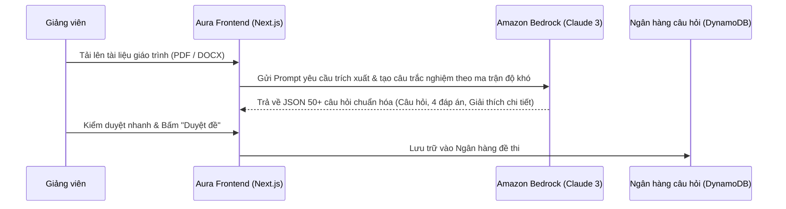

# Tích hợp Trí tuệ Nhân tạo (Generative AI & Computer Vision) trong hệ thống Giám sát phòng thi

> *Bài viết được chia sẻ và thảo luận trên cộng đồng **AWS Study Group Vietnam**:*  
> 👉 [**Xem bài đăng gốc & bình luận trên Facebook**](https://www.facebook.com/photo/?fbid=1676460976896951&set=gm.2201043733993920&idorvanity=660548818043427)  
> 🌐 *Khám phá tính năng AI tại:* [**Aura Academic AI Proctoring**](http://aura-academic-fe-2024.s3-website-ap-southeast-1.amazonaws.com/vi/)

---

## 1. Sức mạnh của AI trong ngành EdTech hiện đại

Nếu như kiến trúc Serverless (S3, Lambda, DynamoDB) giúp hệ thống **Aura Academic** giải quyết hoàn hảo bài toán về độ mở rộng và chi phí hạ tầng, thì **Trí tuệ Nhân tạo (AI/ML)** chính là "linh hồn" mang lại sự khác biệt và tự động hóa toàn diện cho nền tảng.

Trong bài blog thứ 2 này, nhóm chúng tôi xin chia sẻ chi tiết về cách ứng dụng bộ đôi dịch vụ AI hàng đầu của AWS: **Amazon Bedrock (Generative AI)** cho tính năng tạo đề thi thông minh và **Amazon Rekognition (Computer Vision)** cho hệ thống giám sát phòng thi tự động.

---

## 2. Trợ lý AI tạo đề thi thần tốc với Amazon Bedrock

Một trong những công việc tốn thời gian nhất của giảng viên là soạn thảo và chuẩn hóa ngân hàng câu hỏi từ các tài liệu bài giảng dài hàng trăm trang. Với **Amazon Bedrock**, chúng tôi đã tích hợp trực tiếp các mô hình Ngôn ngữ Lớn (LLMs) hàng đầu thế giới như **Claude 3 (Anthropic)** và **Titan Embeddings** vào quy trình tạo đề:

### Điểm nổi bật:
* **Tự động trích xuất ngữ cảnh chính xác:** Mô hình hiểu sâu ngữ cảnh chuyên ngành, tự động tạo câu hỏi phân loại theo 4 cấp độ nhận biết: *Nhận biết - Thông hiểu - Vận dụng - Vận dụng cao*.
* **Bảo mật dữ liệu tuyệt đối:** Khác với việc dùng các API công cộng ngoài thị trường, dữ liệu tài liệu giáo trình tải lên **Amazon Bedrock** được mã hóa hoàn toàn trong VPC riêng của dự án và không bao giờ bị sử dụng để huấn luyện lại mô hình (Zero Data Training Leakage).

---

## 3. Hệ thống Giám sát Phòng thi Thông minh (AI Proctoring) với Amazon Rekognition

Để đảm bảo tính công bằng tuyệt đối trong các kỳ thi trực tuyến, việc phát hiện gian lận bằng mắt thường hoặc qua Zoom/Google Meet là không thể khi lớp học có hàng trăm sinh viên. **Amazon Rekognition** đã giúp chúng tôi giải quyết bài toán này với độ chính xác trên 99%:

| Tính năng Giám sát | Cơ chế hoạt động với Amazon Rekognition | Hành động xử lý tự động của hệ thống |
| :--- | :--- | :--- |
| **Xác thực khuôn mặt (Face Verification)** | So khớp ảnh chụp webcam lúc bắt đầu thi với ảnh thẻ sinh viên lưu trong hồ sơ (`CompareFaces API`). | Chặn truy cập phòng thi nếu độ trùng khớp (Similarity) dưới 90%, chống thi hộ ngay từ vòng gửi xe. |
| **Phát hiện đa nhân diện (Multi-face Detection)** | Phân tích luồng khung hình định kỳ (`DetectFaces API`) để kiểm tra số lượng khuôn mặt xuất hiện trong khung hình. | Cảnh báo lập tức nếu có từ 2 khuôn mặt trở lên xuất hiện (phát hiện có người chỉ bài). |
| **Phát hiện vắng mặt (Absence Detection)** | Nhận diện trường hợp khung hình webcam trống rỗng hoặc sinh viên rời khỏi vị trí thi quá thời gian cho phép. | Ghi nhận Audit Log, tự động nhắc nhở trên màn hình và trừ điểm rèn luyện nếu vi phạm nhiều lần. |

---

## 4. Tối ưu hiệu năng phân tích hình ảnh (Edge-to-Cloud Processing)

Để tránh việc gửi liên tục video HD lên Cloud gây tốn băng thông và chi phí API không cần thiết, chúng tôi áp dụng chiến lược xử lý lai (**Hybrid Edge-Cloud Processing**):
1. **Tại trình duyệt (Client Edge):** Sử dụng thư viện `TensorFlow.js / MediaPipe` nhẹ để phát hiện chuyển động cơ bản ngay trên trình duyệt.
2. **Tại Cloud (Amazon Rekognition):** Chỉ khi client phát hiện sự bất thường (ví dụ: quay đầu sang hai bên liên tục, ánh sáng thay đổi đột ngột hoặc mất mặt), hệ thống mới chụp một khung hình chất lượng cao (Keyframe) và gửi qua API Gateway lên **Amazon Rekognition** để thẩm định chính xác và lưu bằng chứng (Evidence Snapshot) vào **Amazon S3**.

Nhờ kiến trúc thông minh này, chi phí giám sát AI giảm đến **80%** so với việc stream video liên tục lên server truyền thống!

---

## 5. Kết luận

Sự kết hợp giữa **Amazon Bedrock** và **Amazon Rekognition** không chỉ giúp nền tảng **Aura Academic** đạt chuẩn mực bảo mật của các kỳ thi quốc tế mà còn mở ra vô vàn tiềm năng ứng dụng AI trong cá nhân hóa trải nghiệm học tập.

---

> 💬 **Bạn quan tâm đến kỹ thuật Prompt Engineering hay Computer Vision hơn?**  
> Hãy để lại bình luận và chia sẻ góc nhìn của bạn tại bài post cộng đồng:  
> 👉 [**Thảo luận trực tiếp trên bài viết Facebook tại đây**](https://www.facebook.com/photo/?fbid=1676460976896951&set=gm.2201043733993920&idorvanity=660548818043427)
