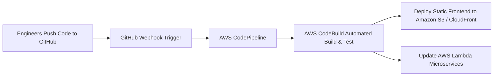

# Automating CI/CD Pipelines, CloudWatch Monitoring & Zero-Trust Security on AWS

> *This article was published and discussed on the **AWS Study Group Vietnam** community:*  
> 👉 [**View Original Facebook Post & Discussion**](https://www.facebook.com/share/p/18uKARgWds/?)  
> 🌐 *Project Portal:* [**Aura Academic Cloud System**](http://aura-academic-fe-2024.s3-website-ap-southeast-1.amazonaws.com/vi/)

---

## 1. Why DevOps and Multi-Layer Security Matter in EdTech

When engineering a large-scale application like **Aura Academic**, having developers continuously push updates to code repositories can easily introduce regressions, integration conflicts, or downtime if deployed manually. Furthermore, online examination systems are prime targets for malicious network attacks (DDoS, SQL Injection, XSS) attempting to manipulate grades or interrupt exam sessions.

In our third engineering blog post, we share how our team applied industry best practices learned during the **First Cloud Journey (FCJ)** program to architect **fully automated CI/CD pipelines**, real-time **observability dashboards**, and **multi-layered web application firewalls** across AWS.

---

## 2. Automated CI/CD Pipeline with AWS CodePipeline & CodeBuild

To eliminate manual deployment risks and streamline continuous delivery, we built a serverless CI/CD pipeline integrated directly with our GitHub repository:

### Automation Workflow:
1. **Source Stage:** Whenever a code commit or Pull Request merges into the `main` branch on GitHub, an automated webhook triggers **AWS CodePipeline**.
2. **Build & Test Stage:** **AWS CodeBuild** provisions an isolated ephemeral container, installs necessary dependencies, executes our automated testing suite (Unit & Integration tests), and compiles our Next.js frontend into static build artifacts.
3. **Deploy Stage:** 
   - For Frontend: CodeBuild syncs static assets to our **Amazon S3** origin bucket and automatically triggers a `CloudFront Cache Invalidation` so students and faculty immediately experience the latest UI updates without stale caching.
   - For Backend: Updates code packages across our **AWS Lambda** microservices via AWS SAM / CloudFormation using **Canary Deployments** (routing 10% of live traffic initially to verify stability before shifting 100%).

---

## 3. Real-Time Observability with Amazon CloudWatch & SNS

High availability requires proactive observability. We established **Amazon CloudWatch** as our centralized operational intelligence hub:

| Operational Metric | Monitored AWS Service | Alarm Threshold (CloudWatch Alarm) | Automated Remediation Action |
| :--- | :--- | :--- | :--- |
| **API Error Rate (5xx Errors)** | Amazon API Gateway | > 1% of total request volume across 5 mins | Dispatches critical alert via **Amazon SNS** to engineering email/Telegram channels. |
| **Lambda Duration & Throttling** | AWS Lambda | Execution duration exceeding 8 seconds or any throttle events | Automatically scales reserved concurrency limits and notifies backend team. |
| **DynamoDB Consumed Capacity** | Amazon DynamoDB | Reaches 85% of Provisioned Read/Write Units | Triggers Auto-Scaling to dynamically provision additional table capacity. |

---

## 4. Defense-in-Depth (Zero-Trust Security & AWS WAF)

Security is our top priority for high-stakes online examinations. We implemented a robust **Defense-in-Depth** architecture:
* **Edge Protection:** Deployed **AWS WAF (Web Application Firewall)** directly in front of **Amazon CloudFront** and **API Gateway**. WAF is configured with AWS Managed Rules to inspect and block OWASP Top 10 vulnerabilities (SQL Injection, Cross-Site Scripting, and malicious automated bots).
* **Sensitive Secrets Management:** All database connection strings, JWT secret keys, and third-party API tokens are securely encrypted inside **AWS Secrets Manager**, eliminating hardcoded credentials completely.
* **Identity & Access Governance (IAM & ABAC):** Enforced strict *Least Privilege Principle*. Each Lambda microservice is granted a dedicated IAM execution role with permissions scoped restricted strictly to its assigned DynamoDB table or S3 bucket.

---

## 5. First Cloud Journey (FCJ) Program Reflection

Over 11 intensive weeks of hands-on training during our **First Cloud Journey (FCJ)** internship, our engineering team transformed from cloud novices into confident builders capable of architecting scalable, secure, and cost-efficient cloud systems on AWS.

We express our sincere gratitude to our technical mentors and the entire **AWS Study Group Vietnam** community for their continuous guidance, support, and inspiration!

---

> 💬 **Are you currently implementing CI/CD pipelines or AWS WAF in your cloud projects?**  
> Share your questions and engineering experiences on our official community post:  
> 👉 [**Join the Technical Discussion on Facebook**](https://www.facebook.com/share/p/18uKARgWds/?)
