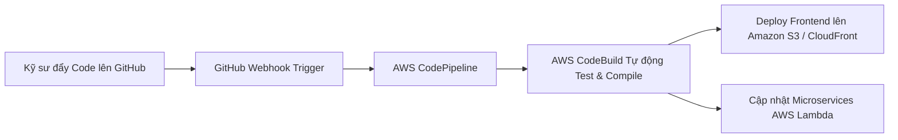

# Tự động hóa CI/CD Pipeline, Giám sát CloudWatch và Bảo mật Zero-Trust trên AWS

> *Bài viết được chia sẻ và thảo luận trên cộng đồng **AWS Study Group Vietnam**:*  
> 👉 [**Xem bài đăng gốc & bình luận trên Facebook**](https://www.facebook.com/share/p/18uKARgWds/?)  
> 🌐 *Cổng thông tin dự án:* [**Aura Academic Cloud System**](http://aura-academic-fe-2024.s3-website-ap-southeast-1.amazonaws.com/vi/)

---

## 1. Tầm quan trọng của DevOps và Bảo mật trong hệ thống EdTech

Khi phát triển một ứng dụng quy mô lớn như **Aura Academic**, việc các kỹ sư liên tục đẩy code mới lên repository hàng ngày rất dễ phát sinh lỗi hoặc xung đột hệ thống nếu làm thủ công. Đồng thời, các hệ thống thi cử trực tuyến luôn là đích nhắm của các cuộc tấn công mạng (DDoS, SQL Injection, XSS) nhằm thay đổi điểm số hoặc đánh sập phòng thi.

Trong bài viết thứ 3 này, chúng tôi chia sẻ cách nhóm đã áp dụng các phương pháp tốt nhất (Best Practices) từ chương trình **First Cloud Journey (FCJ)** để xây dựng hệ thống **CI/CD hoàn toàn tự động**, quản trị **giám sát thời gian thực** và thiết lập **tường lửa nhiều lớp** trên AWS.

---

## 2. Luồng CI/CD Pipeline Tự động hóa với AWS CodePipeline & CodeBuild

Để loại bỏ hoàn toàn việc triển khai thủ công (Manual Deployment) và giảm thiểu lỗi con người, chúng tôi đã xây dựng pipeline CI/CD tích hợp trực tiếp với GitHub Repository:

### Quy trình tự động hóa:
1. **Source Stage:** Ngay khi một commit hoặc Pull Request được merge vào nhánh `main` trên GitHub, webhook sẽ lập tức kích hoạt **AWS CodePipeline**.
2. **Build & Test Stage:** **AWS CodeBuild** khởi tạo một container tạm thời, cài đặt các dependencies, chạy bộ kiểm thử tự động (Unit Tests / Integration Tests), và compile source code Next.js thành gói tĩnh (build artifacts).
3. **Deploy Stage:** 
   - Đối với Frontend: CodeBuild tự động đồng bộ (sync) các file mới lên **Amazon S3** và gọi lệnh `Invalidate Cache` trên **Amazon CloudFront** để người dùng lập tức thấy giao diện mới mà không bị lưu cache cũ.
   - Đối với Backend: Cập nhật code mới cho các hàm **AWS Lambda** thông qua AWS SAM / CloudFormation với cơ chế **Canary Deployment** (chuyển dần 10% traffic sang version mới để kiểm tra độ ổn định trước khi chuyển 100%).

---

## 3. Giám sát hệ thống thời gian thực với Amazon CloudWatch & SNS

Một hệ thống High Availability không cho phép kỹ sư "đợi khách hàng báo lỗi mới biết server sập". Chúng tôi cấu hình **Amazon CloudWatch** làm trung tâm giám sát sức khỏe toàn diện:

| Chỉ số giám sát (Metrics) | Dịch vụ theo dõi | Ngưỡng cảnh báo (CloudWatch Alarm) | Hành động phản ứng tự động |
| :--- | :--- | :--- | :--- |
| **API Error Rate (5xx Errors)** | Amazon API Gateway | > 1% tổng số request trong 5 phút | Gửi cảnh báo khẩn cấp qua email/telegram qua **Amazon SNS**. |
| **Lambda Throttling / Duration** | AWS Lambda | Thời gian thực thi vượt quá 8 giây hoặc có Throttling | Tự động tăng Concurrency limit và cảnh báo team Backend. |
| **DynamoDB Consumed Capacity** | Amazon DynamoDB | Chạm ngưỡng 85% Provisioned Capacity | Kích hoạt Auto-Scaling mở rộng read/write capacity tức thì. |

---

## 4. Bảo mật nhiều lớp (Zero-Trust Security & AWS WAF)

Bảo mật là ưu tiên số 1 trong các kỳ thi trực tuyến. Chúng tôi triển khai mô hình bảo mật theo chiều sâu (**Defense in Depth**):
* **Bảo vệ biên (Edge Protection):** Tích hợp **AWS WAF (Web Application Firewall)** ngay phía trước **Amazon CloudFront** và **API Gateway**. WAF được cấu hình các bộ quy tắc (Managed Rules) của AWS để chặn đứng OWASP Top 10 (SQL Injection, Cross-Site Scripting, Bad Bots).
* **Quản lý thông tin nhạy cảm:** Toàn bộ DB Connection Strings, JWT Secrets và API Keys được lưu trữ an toàn trong **AWS Secrets Manager**, tuyệt đối không hard-code trong source code.
* **Quản trị định danh IAM & ABAC:** Áp dụng nguyên tắc quyền hạn tối thiểu (*Least Privilege Principle*), mỗi hàm Lambda chỉ được cấp một IAM Role duy nhất với quyền truy cập đúng bảng DynamoDB hoặc S3 Bucket mà nó phụ trách.

---

## 5. Tổng kết hành trình First Cloud Journey (FCJ)

Trải qua 11 tuần thực tập và rèn luyện cường độ cao tại **First Cloud Journey (FCJ)**, từ những sinh viên còn bỡ ngỡ với khái niệm Cloud, nhóm chúng tôi đã tự tin làm chủ và kiến thiết những hệ thống thực tế quy mô lớn, an toàn và tối ưu chi phí trên AWS.

Xin gửi lời cảm ơn sâu sắc đến các Mentor và cộng đồng **AWS Study Group Vietnam** đã luôn đồng hành, hướng dẫn và truyền cảm hứng!

---

> 💬 **Bạn có đang áp dụng CI/CD hay AWS WAF cho dự án của mình không?**  
> Hãy cùng trao đổi kinh nghiệm và câu hỏi tại bài đăng chính thức của nhóm:  
> 👉 [**Tham gia thảo luận trên Facebook tại đây**](https://www.facebook.com/share/p/18uKARgWds/?)
